# Dactyl ManuForm Mini Keyboard

This is a fork of the [Dactyl-ManuForm-Mini](https://github.com/l4u/dactyl-manuform-mini-keyboard). The Dactyl-Manuform-Mini is a fork of the [Dactyl-Manuform](https://github.com/tshort/dactyl-keyboard), which is a fork of the [Dactyl](https://github.com/adereth/dactyl-keyboard) with the thumb cluster from [ManuForm](https://github.com/jeffgran/ManuForm).

## Features

Here is the list of features which have been added after the fork from the Dactyl Manuform Mini:

- The use of sidenubs is disabled by default. 
- Top surface is extra thick (3mm), so it can be printed with wooden PLA filament (which is brittle)
- The TRSS hole is bigger to use another type of female insert
- TRSS hole has hole around it so the insert can go in deeper
- The USB hole is bigger, so it can house an adapter. The adapter is to be designed and printed separately. At the moment the only adapter that has been made is an USB-C one. 
- The USB and TRSS holders have been removed

## Getting the case and bottom plate

### Option 1: Generate OpenSCAD and STL models

* Run `lein generate` or `lein auto generate`
* This will regenerate the `things/*.scad` files
* Use OpenSCAD to open a `.scad` file.
* Make changes to design, repeat `load-file`, OpenSCAD will watch for changes and rerender.
* When done, use OpenSCAD to export STL files

### Option 2: Use the stl files

Print right.stl and left.stl.

For he bottom plate, use right-plate.svg, which can be reversed for the left. Since it's an svg file it can either be used to cut into acrylic or wood, or modified into an stl to be 3d printed.

For USB-C, use the adapter usb-c-4-hole-dactyl v17.stl

## License

Copyright © 2015-2019 Matthew Adereth, Tom Short, Leo Lou and Quentin Lebastard

The source code for generating the models is distributed under the [GNU AFFERO GENERAL PUBLIC LICENSE Version 3](LICENSE).


## Build log
### Printing the case
Wooden PLA material is a pain to print - had to print very slowly (roughly 40hrs per side).
The material is quite brittle, so had to change the wall thickness to 3mm (from 2). Even with that, I managed to break a side when forcing too much. Be gentle with your keyboard ! I managed to fix it with some hot glue but something to keep in mind.
All in all the print quality is still pretty good.

It was printed with an Ender 3.


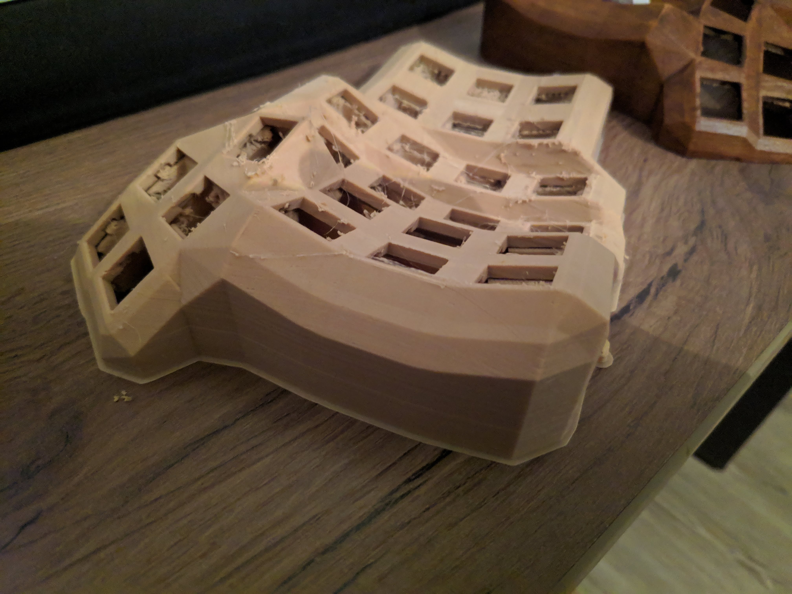

## Preparing the case
The case was varnished with four layers of wallnut varnish. Under it, I used my soldering iron to "melt in" the M3 female threads.

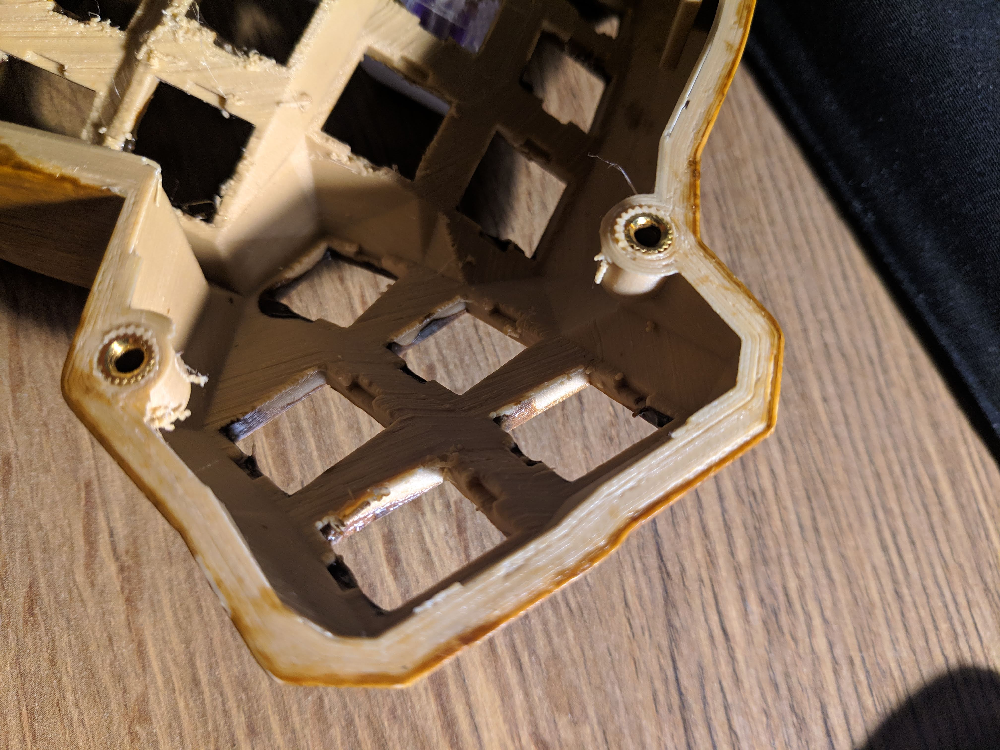

## Bottom of the case
I went to a fablab (big shootout to La Casemate) to prepare acrylic and wood plates for the bottom.

The wood plates were varnished as well.

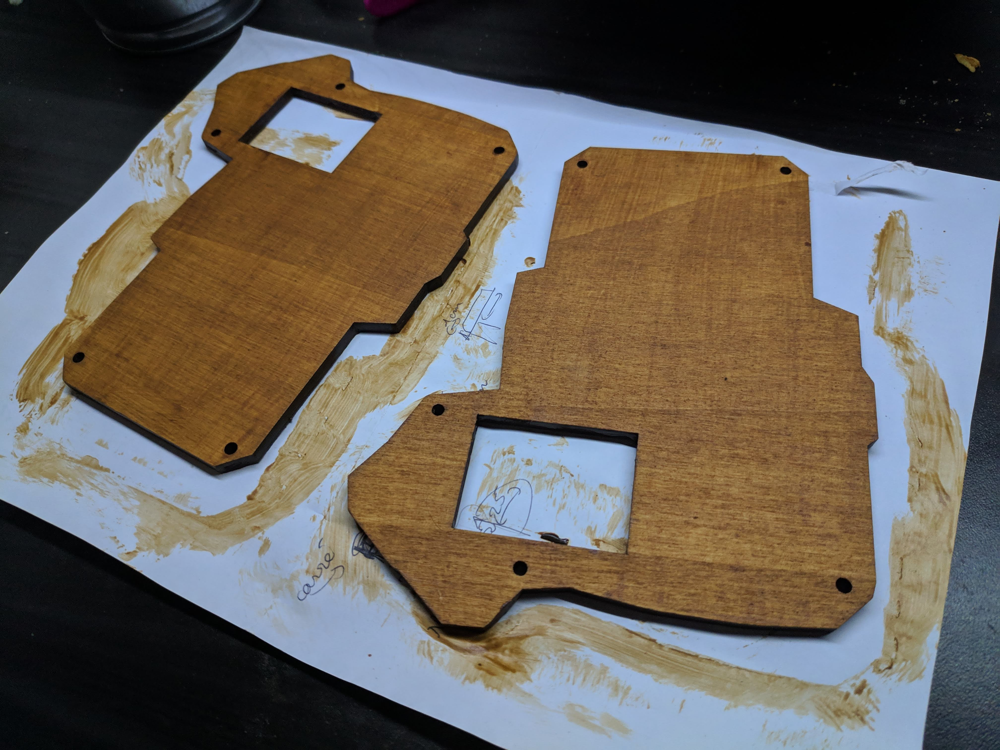
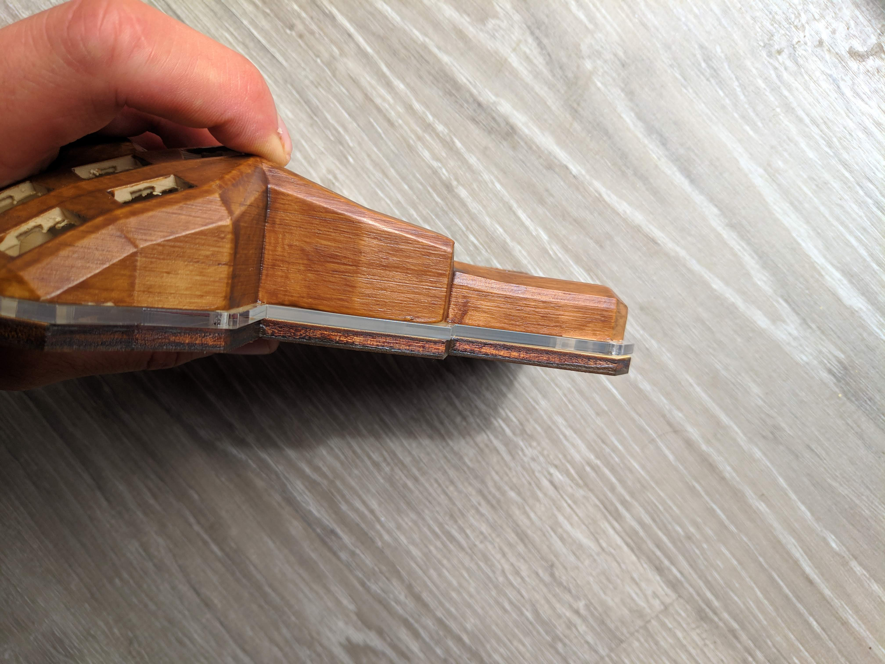

## Preparing and adding the switches
For this build I chose Aliaz switches - they're pretty silent which is one of the objectives when building this keyboard.

However they are too hard for me, which is why I changed the springs to 35g and lubed the sides with some tribosys 3204.
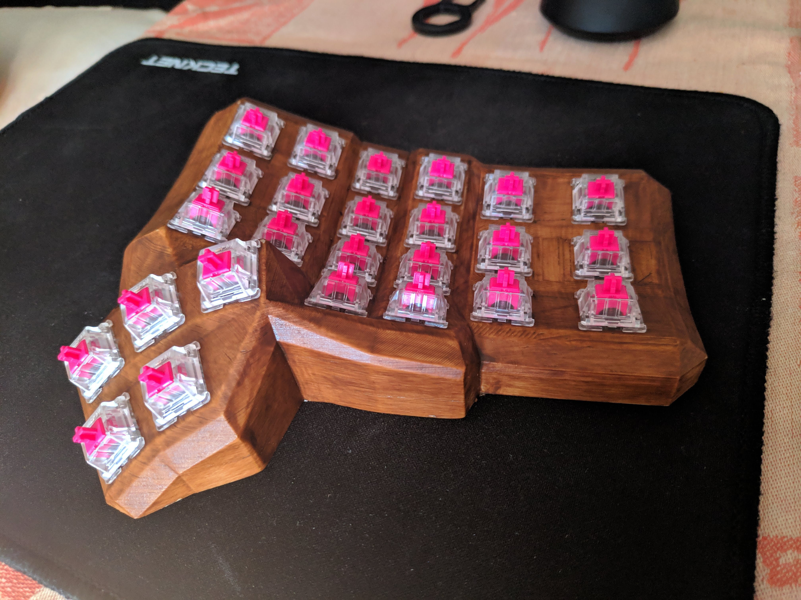

## Adding keycaps
Not quite sure yet of the theme I want, at the moment I went with some B&W DSA keycaps with pretty big orings - to reduce the noise even more, and because I prefer short travel.

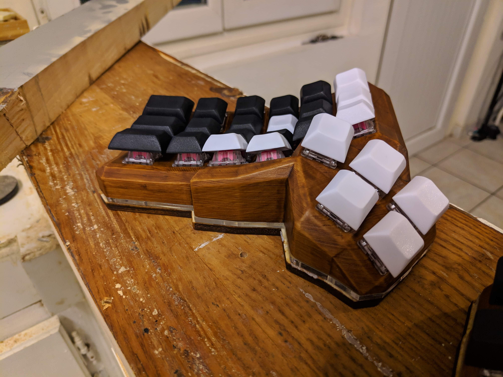

## Adding bluetooth

Flash an HC05 with the following tutorial: https://www.instructables.com/id/Upgrade-Your-3-Bluetooth-Module-to-Have-HID-Firmwa/

You can also use an RN42 but it's going to be more expensive.

At this moment, I'm waiting on an USB shield to continue the wiring


## Wiring everything
Wire the columns and rows together (there are guides online)
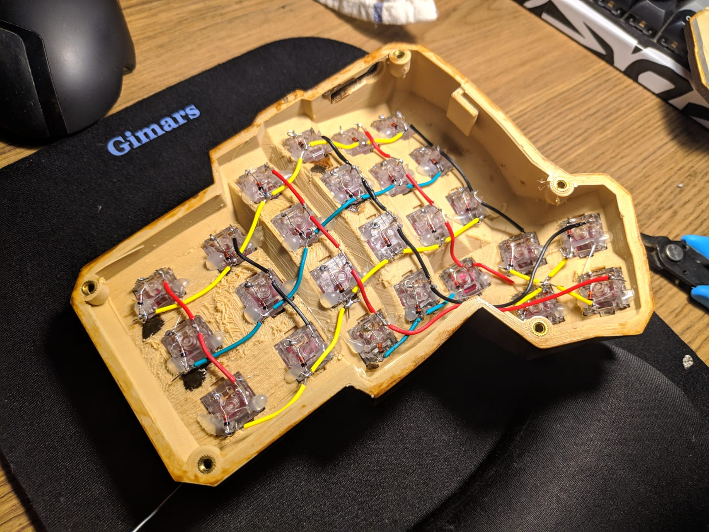


## Add USB-C and 3.5mm jack

Wire the serial as instructed [here](https://github.com/qmk/qmk_firmware/tree/master/keyboards/handwired/dactyl_manuform).
Basically, just connect GND, VCC and D0.
As said [here](https://beta.docs.qmk.fm/reference/config_options), use one of these pins: D0 or D1, D2, D3, E6

I used serial because it uses only 3 signals, so that I can use a standard jack cable.

I used an usb-c female port to give my keyboard USB-C, using [this tutorial](https://www.scorpia.co.uk/2016/03/17/using-usb-type-c-on-hobyist-projects/). Basically: connect the mini usb's GND and VCC, and then D+ to both D+, D- to both D- on the usb-C receptacle.

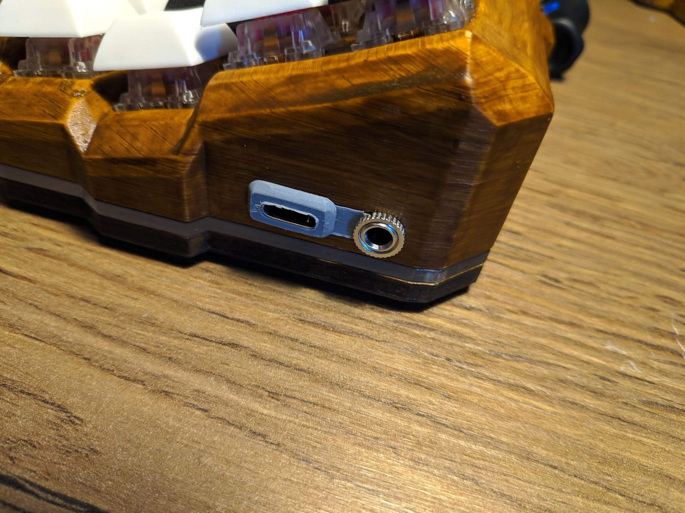
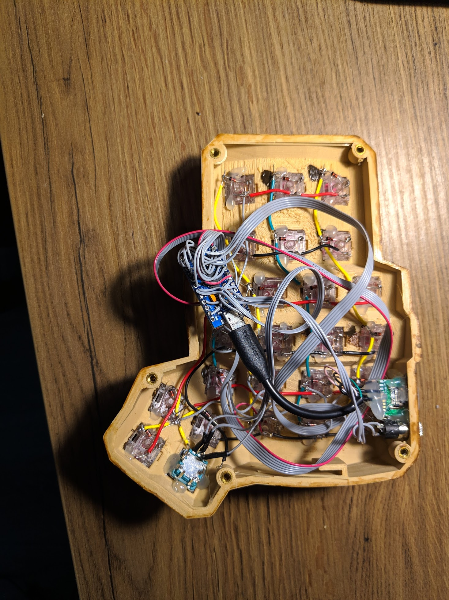

## Adding a knob
I used an EC11 knob, you need to connect its A and B lines to any of the pro micro's available pins as well as the GND.
Then, follow [qmk's guide](https://docs.qmk.fm/#/feature_encoders)

I printed an adapter for the encoder, it's made by [hellmoneywarriors on reddit](https://www.reddit.com/r/MechanicalKeyboards/comments/chs82g/designed_a_new_adapter_for_installing_rotary/?st=jzpioq7c&sh=33f65e95) and can be found here: https://www.thingiverse.com/thing:3770166


## Adding the rgb strip
I added one rgb led strip on each side, on pin D1. Each side has 10 rgbw leds.

I had to activate the following options in `config.h`:

```
#define RGB_DI_PIN D1
#define RGBLED_NUM 10
#define RGBLIGHT_ANIMATIONS
#define RGBW
#define RGBLIGHT_SPLIT
#define RGBLED_SPLIT { 10, 10 }
```

There is a guide in [qmk's official docs](https://beta.docs.qmk.fm/features/feature_rgblight)


## Flashing with QMK
I use the french bepo layout, the source code is in [my fork](https://github.com/lebastaq/qmk-firmware)

## Typing test

https://youtu.be/aG2hiXtmREg


## More pictures

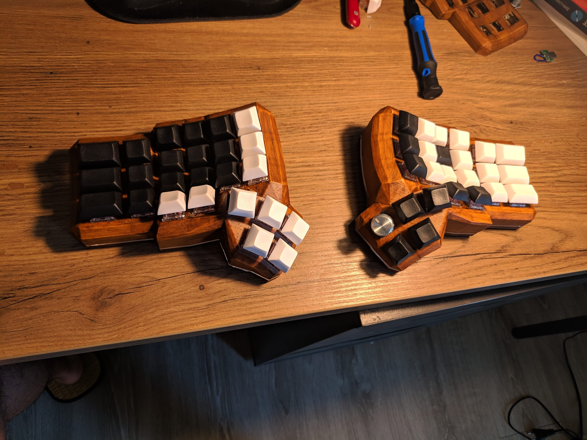
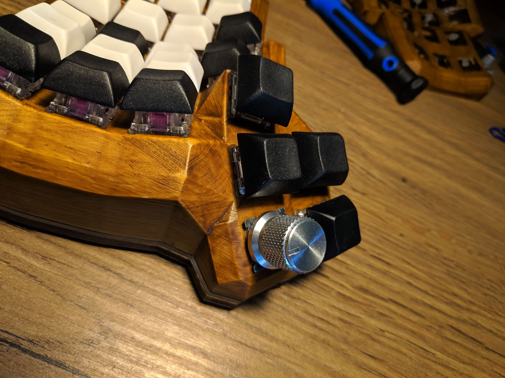
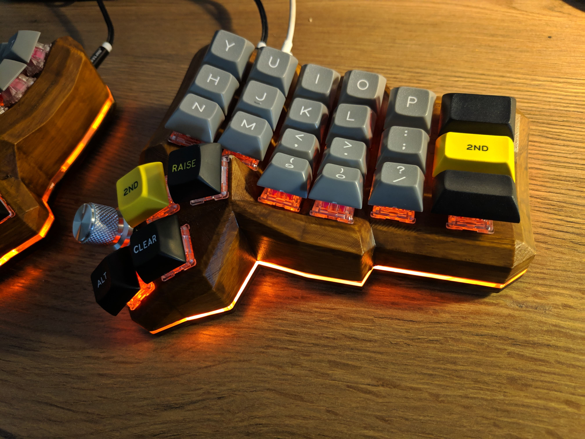
